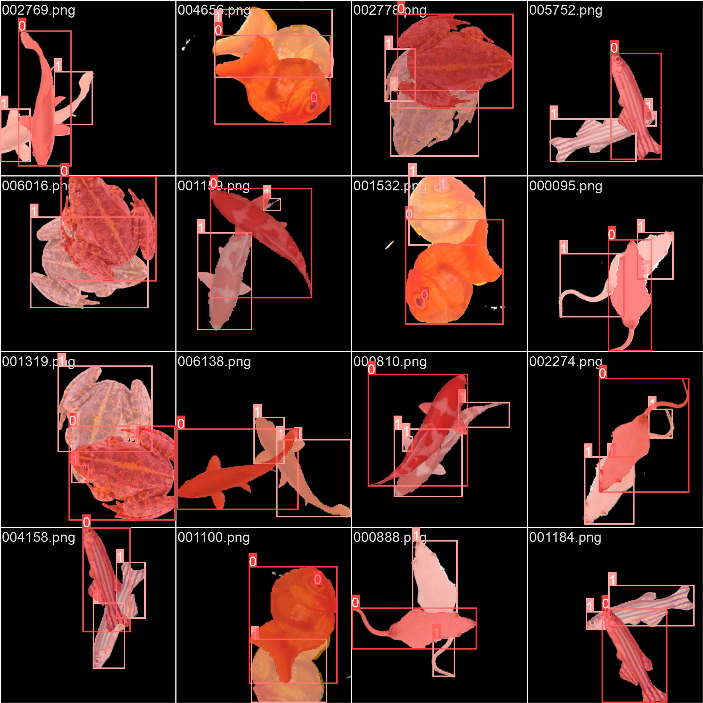

# Abstract
Deep learning techniques have undergone extensive exploration for object tracking, primarily addressing the intricate issue of occlusion. Occlusion occurs when one object is obscured by another, which becomes particularly challenging when dealing with similar objects. Successful methods have been developed in scientific tracking scenarios, such as monitoring animal behavior or particle movement, although these often necessitate the construction of complex models. In this context, we introduce an innovative approach that leverages well-established and easily deployable models like YOLO to mitigate challenges posed by occlusion. Our strategy involves adapting YOLOv8 through training on synthetic data, enabling efficient model generation even on modest hardware. The results underscore its robust performance and generalization capabilities, highlighting the effectiveness of this streamlined approach in resolving occlusion-related tracking issues.

# Introduction
Numerous tools have been documented in the existing literature for the application of deep learning techniques in the field of object tracking. One particularly significant challenge deep learning can address is mitigating occlusion-related issues. Occlusion arises when one object is partially obscured by another, and the complexity deepens when these objects are self-similar. Several approaches have demonstrated success when focusing on the context of scientific tracking, such as monitoring animal behavior or particle movement [Gelencsér-Horváth, Anna, et al. "Tracking Highly Similar Rat Instances under Heavy Occlusions: An Unsupervised Deep Generative Pipeline." Journal of Imaging 8.4 (2022): 109.]. However, these methods typically involve constructing models from the ground up. This process proves to be intricate, especially when considering its integration into experimental settings involving researchers who may not possess an in-depth proficiency in domains like deep learning or computer hardware, and the source code is sometimes missing in the article.

This article showcases a novel strategy: adapting pre-existing, extensively utilized models that are well-maintained, easily deployable, and require minimal expertise to set up and operate. To address occlusion-related challenges, we harness the power of the YOLO algorithm conventionally employed for instance-segmentation tasks. Our approach involves training the YOLO model on synthetic data, which can be generated quickly. This methodology offers the advantage of being executable on moderately equipped personal computers or even through platforms like Google Colab, enabling the training and utilization of a model in under an hour.

# Methods
## Image generation
The first step of this study is to generate synthetic data for training the YOLO detector. To create this data, we begin with an image of an object on a transparent background. Random translations and rotations are applied to the object to produce the lower image. This process is repeated for the same object to obtain the upper image. By superimposing these two images, we generate an occlusion.

In the resulting image, pixels corresponding to the upper object are identified where the transparency of the upper image is not equal to 0:

$$ M_{top} = \alpha_{top}$$

Pixels corresponding to the lower object are identified where the transparency of the lower image differs from the transparency of the upper image:

$$ M_{bottom} = \alpha_{bottom} - \alpha_{top} $$

Next, we combine the two images using the following formula. We apply a Gaussian filter to smooth the edges of the two masks and utilize a solid color for the background.

$$ I_{merged} = I_{background} \cdot (1 - M_{bottom}) \cdot (1 - M_{top}) + M_{top} \cdot I_{top} + M_{bottom} \cdot I_{bottom} $$

Subsequently, the merged image is subjected to a Gaussian filter to blur the edges and simulate an accurate occlusion more closely.

This method allows for 360 possible rotations and a translation range of 300 pixels in both vertical and horizontal directions, enabling us to generate approximately $8 \times 10^{10}$ unique combinations.

The dataset is divided into three parts: training and validation sets for the model training and a test set for model evaluation. While multiple objects are used to create the training and validation dataset, the test dataset is constructed using an object that the model has not seen before, serving as a measure of the model's generalization capability.
In practice, it's possible to train on only one object and apply the model to the same object, resulting in high performance for occlusion solving with that specific object but with limited generalization to other objects.

In this article, we compiled the training and validation datasets using images of three distinct fish species, a frog, and a mouse, while the test dataset was composed of a picture of a rabbit.

## Annotation generation
The annotations can be generated by detecting the object contours on the top and bottom masks. The annotations need to be formatted following the convention: 'object_id x1 y1 x2 y2 ...' with the coordinates of a polygon outlining the object. The top object will always have only one polygon as it is not occluded. The bottom object can have several polygons, and we choose to retain only the three largest polygons. Ultimately, an annotation for one image will consist of one line for the top object and a maximum of three lines for the bottom object.

## Training
The model is then trained using the YOLOv8 nano model. YOLOv8 is easy to install and use and is regularly maintained and updated by Ultralytics. We trained the model only with scaling, mirroring, and translation data augmentation from YOLO, as the images provided always consist of only two objects. We used 200 epochs with a batch size of 8 images and default parameters. The training was conducted using an NVidia RTX 3050. For individuals without access to a GPU, it is possible to use Google Colab in conjunction with Google Drive for training the model (see Appendix).

# Results
The COCO mean average precisions (mAPs) are employed to evaluate the instance-segmentation model's performance. This metric considers both the object class and its segmentation, as detailed at https://cocodataset.org/#detection-eval.

Figure 2a illustrates the mean Average Precision (mAPs) for the validation dataset, corresponding to the validation process conducted during training on a dataset composed of the same objects as the training set. These mAPs are plotted against the training epochs. The convergence towards an mAP of approximately 0.77 indicates the model's capability to detect and segment the top and bottom objects in the images. In Figure 2b, the model's proficiency is showcased through the masks predicted on the validation dataset. It is evident that the most substantial part of the occluded object is consistently detected, with errors primarily concentrated in smaller regions.

In Figure 3, we showcase the model's proficiency on the test set. This evaluation is conducted on a test dataset comprising objects that were not encountered during the training phase. Remarkably, even when faced with this novel data, the mAPs remain high ($mAP_{50} \approx 0.83$ and $mAP_{50-95} \approx 0.68$). Figure 3 visually validates the accuracy of the predicted masks, effectively demonstrating the model's capability in detecting the majority of occluded objects. Errors are primarily concentrated in smaller hanging parts that will have a minor influence in the tracking context. These findings underscore the model's ability to generalize effectively, even when utilizing a limited dataset that encompasses only five distinct objects.

Finally, we assessed the model's performance using actual data extracted from the ZFA_002 and ZFA_003 videos within the $TD^2$ dataset [http://data.ljp.upmc.fr/datasets/TD2/]. Employing transfer learning, we retrained the model by using a new dataset constructed from an image captured under occlusion-free conditions. The model underwent 50 epochs of retraining. The outcomes of this training are presented in Figure 4a, while the results of instance segmentation are exhibited in Figure 4b. These segmentations were executed on images sourced from ZFA_003, encompassing occlusion instances. It's worth noting that the segmentation yields a notably high degree of accuracy in capturing most fish.

# Discussion
We have demonstrated the successful repurposing of a well-known instance-segmentation model to address the occlusion problem by generating synthetic data and training the model with two classes. In this article, we utilize a limited quantity of images (7 000 for training, 2 500 for validation, and 500 for testing) involving only five object types, yet we achieve favorable performance and notable generalization. These achieved performances are considered acceptable within the context of occlusion-solving for tracking.
Furthermore, thanks to the streamlined workflow, attaining top-tier performance is within reach by retraining the model with a more extensive image corpus or refining specificity through training with a single object type. Another strategy involves augmenting the dataset with diverse backgrounds and adjusting the scale of the lower object (or increasing the scale of the upper object) to facilitate the model's understanding of perspective. Additionally, sharpening the image to enhance edges can prove effective in addressing occlusion challenges. Using a different YOLOv8 model variant, such as small, medium, large, or extra-large, can also lead to more accurate results.
The source code of the POC used in this article is available at https://github.com/FastTrackOrg/FastOcclusion.git, and this capability will be added in the near future to PyFastTrack.
